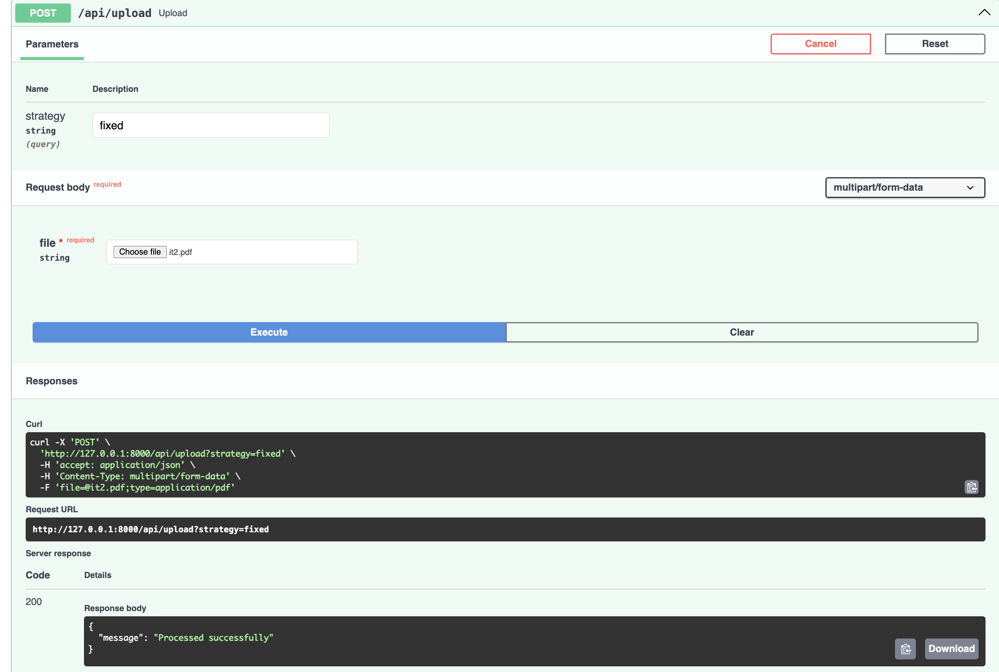
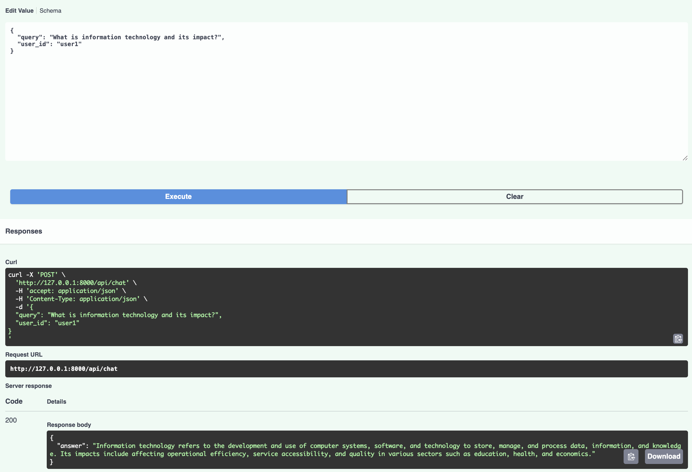
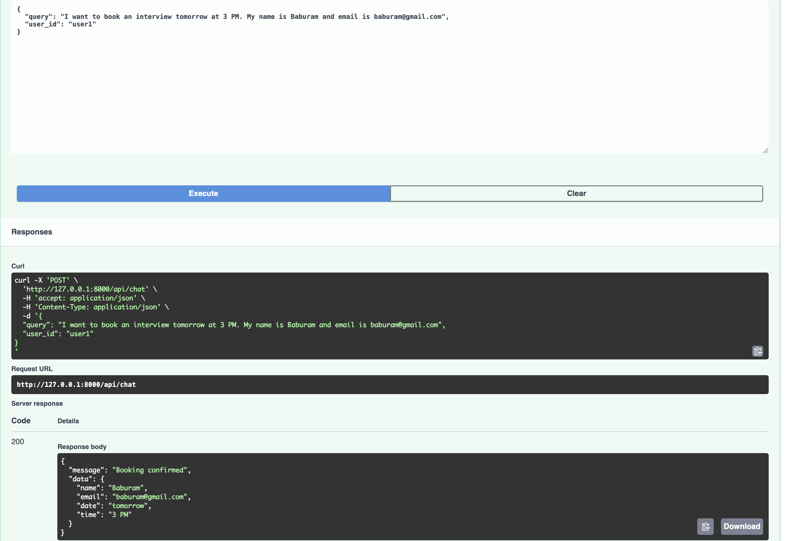

# RAG Backend (FastAPI)

# Features
- Document ingestion (PDF/TXT)
- Chunking strategies
- Embedding with SentenceTransformer
- Vector DB using Qdrant
- Custom RAG pipeline
- Redis chat memory
- Booking system via LLM

## Run

pip install -r requirements.txt

uvicorn main:app --reload

# Additional Description: 
here we have implemented all the required objective of the task given by palm ai. At first the documenT(PDF/TXT) is loaded and then it converts to the document and then chunking happens, after that it is transformed into vector and store in Qdrant vector store, after that the rag pipeline is setup and top 5 results were filter out from the similarity distance search, then it pass that context to the llm and it will generate the answer on the basis of that context. 

## http://127.0.0.1:8000/docs( to check the api endpoints visit this /docs url)

Here are some visual of it :
(upload pdf)

(normal query)
 

(interview booking)
 